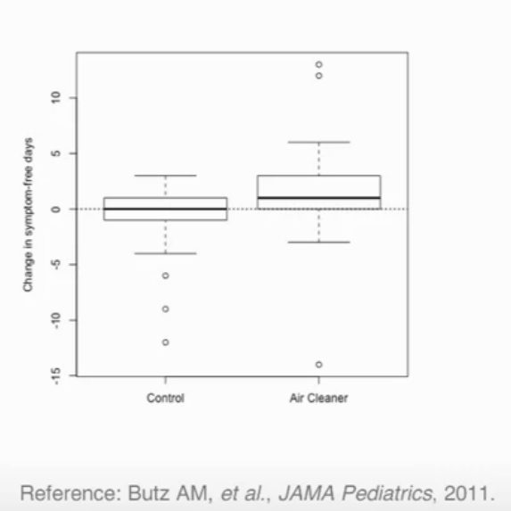
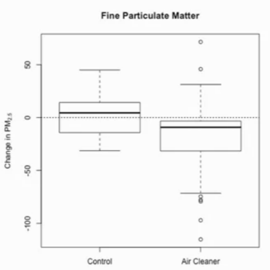
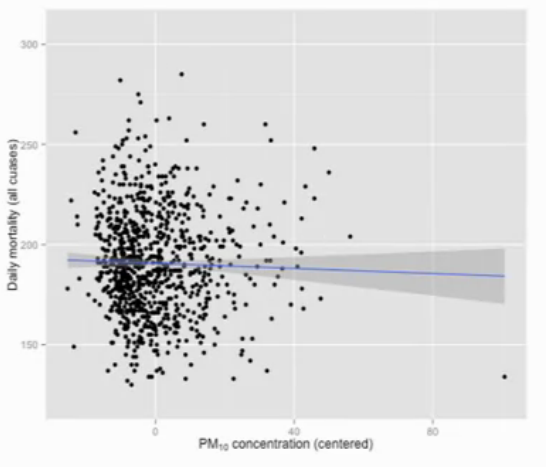
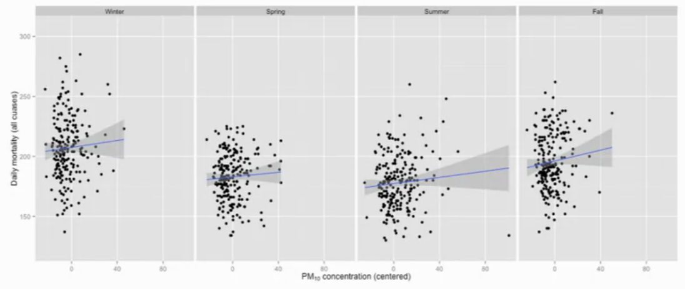
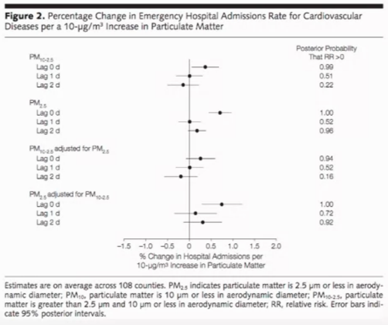
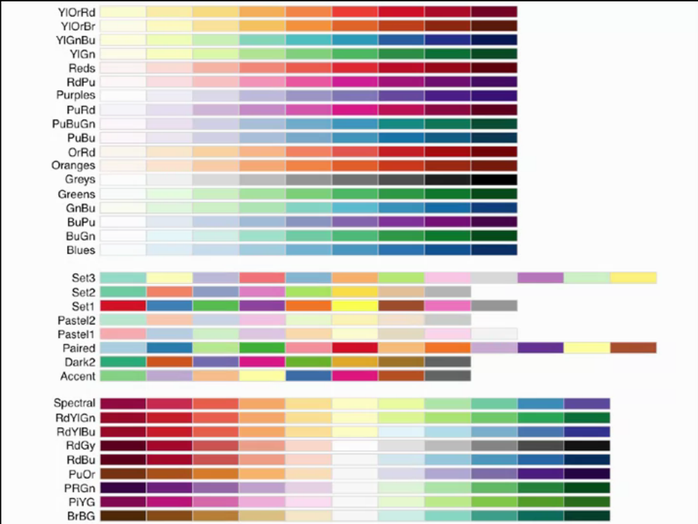

```{r setup, include=FALSE}
knitr::opts_chunk$set(echo = TRUE)
```

# Intro  
* **[Slides and data for this course may be found at github](https://github.com/DataScienceSpecialization/courses/tree/master/04_ExploratoryAnalysis)**  

## Instructor's Note  
*This course covers the essential exploratory techniques for summarizing*   
*data. These techniques are typically applied before formal modeling*  
*commences and can help inform the development of more complex statistical*  
*models. Exploratory techniques are also important for eliminating or*  
*sharpening potential hypotheses about the world that can be addressed by*  
*the data. We will cover in detail the plotting systems in R as well as*  
*some of the basic principles of constructing data graphics.*   
*We will also cover some of the common multivariate statistical techniques*   *used to visualize high-dimensional data.*  
  
*All the best,*  
  
*Roger Peng*  

## Introduction  
* EDA allows you to develop a rough idea of what your data look like and what kinds of questions might be answered by them. 
* EDA is often the "fun part" of data analysis, where you get to play around with the data and explore.  
* These techniques for summarizing data are typically applied before formal modeling commences and can help inform the development of more complex statistical models.


## Exploratory Data Analysis with R Book  
* **[Exploratory Data Analysis with R](https://leanpub.com/exdata)**


## The Art of Data Science  
* **[The Art of Data Science eBook](https://leanpub.com/artofdatascience/)**  
* **[The Art of Data Science printed version](http://www.lulu.com/shop/roger-peng-and-elizabeth-matsui/the-art-of-data-science/paperback/product-22358436.html)**

## Installing R on...
### Windows  
* Just go to **[the cran site](https://cran.r-project.org/)** and install the Windows version.  
        + For an optimal experience, back up all of data onto a usb, then install your preferred version of Linux (I use Fedora) and install the Linux version instead.  

### Mac  
* Just go to **[the cran site](https://cran.r-project.org/)** and install the Mac version.  
        + If you don't have enough money to buy a Mac install Linux instead, it's open-source, meaning it's free!  

## Installing R Studio (Mac)  
* Install from **[the RStudio website](https://rstudio.com/products/rstudio/download/)** *after* you have `R` installed.  

## Setting Your Working Directory on...
### Windows, Mac & Linux 
* Your working directory is where R will look for all the files it reads and where all the files it writes will go  

* `getwd()` will display your current working directory
* `dir()` will display all files in your wd
* `setwd(param)` will set your working directory to the character string that is represented by `param`  
* `source("myFunction.R")` will load in `myFunction` script from wd and any functions that are within it.


# Lesson 1: Graphs
## Principles of Analytic Graphics  
* Some general rules to follow when building analytic graphics from data to tell the story the data hold.  

* Principles:

1) Show Comparisons
  + Evidence for a hypothesis is always *relative* to another competing hypothesis  
  + Always ask "Compared to What?"
  + For example a box plot of **Change in symptom-free days** in children with asthma when an **Air Cleaner** is installed in their quarters should be shown in *comparison* to a control group
  

2) Show Causality, Mechanism, or Explanation  
  + To show what is going on/how you believe the system is operating and what is the cause for the result you are showing.
  + What is your causal framework for thinking about a question
  + This only shows a suggestion and indicates where further investigation could go
  + In the asthma example you would also want to show the **Change in PM** (Particulate Matter) in the child's home between the **Control** and **Air Cleaner**  


3) Show Multivariate Data 
  + Show as much data on a plot as you reasonably can, it tells a richer story  
  + The real world is multivariate, so your plots should reflect that  
  + Need to "escape flatland"
  + For example, below is a 2-D plot of **Daily mortality** versus **PM concentration** in NYC, and it shows a slight decrease in mortality as PM increases.  

  + However, if we plot this across four plots for each season we can see an increase in mortality within each season  

  
4) Integration of Evidence  
  + Don't let the tool drive the analysis  
  + Completely integrate words, numbers, images, and diagrams  
  + Data graphics should make use of many modes of data presentation  
  + Put lot of information on the plots rather than different places where it may be hard to track down
  + The following example shows a plot that has a column for probability that the hospitalizations are different than 0, (the left side is labeling the rows), and the bottom is describing how the experiment was performed  

  
5) Describe and Document the Evidence
  + Use appropriate labels, scales, sources, etc.  
  + A data graphic should tell a complete story that is also credible  
  
6) Content is King  
  + If there isn't an interesting story to tell no amount of presentation will make it interesting  
  + Analytic presentations ultimately stand or fall depending on the quality, relevance, and integrity of their content  
  
* Further Reading - **[Edward Tufte's Beautiful Evidence ($32)](https://www.edwardtufte.com/tufte/books_be)**


## Lesson with `swirl()`: Principles of Analytic Graphs  
* This lesson runs through the 5 principles that were discussed in the above lecture.
* The multivariate plot was an example of **[Simpson's paradox, or the Yule-Simpson effect](http://en.wikipedia.org/wiki/Simpson%27s_paradox)**
* With R, you want to preserve any code you use to generate your data and graphics so that the research can be replicated if necessary.  
  + This allows for easy verification or finding bugs in your analysis  


## Exploratory Graphs
* These are graphs that are made for yourself to look at and explore the data sets you're looking at  
* Why do we use graphs in data analysis?
    - To understand data properties  
    - To find patterns in data  
    - To suggest modeling strategies  
    - To "debug" analyses  
    - To communicate results  
  +  Exploratory graphs are for the first four of these reasons  

* Characteristics of exploratory graphs  
  + They are made quickly ("on the fly")  
  + A large number are made  
    - Looking through a lot of the variables and different aspects of the data  
  + The goal is for personal understanding  
    - What are the properties, problems, and issues that need followed up  
  + Axes/legends are generally cleaned up later  
  + Color/size are primarily used for information, rather than presentation  
  
* The following examples will be using data about ambient air pollution in the United States for particle pollution (PM2.5), the "annual mean, averaged over 3 years" cannot exceed 12 micro-grams/cubic meter  
```{r}
pollution <- read.csv("./data/avgpm25.csv", 
                      colClasses = c("numeric", "character", "factor", 
                                     "numeric", "numeric"))
head(pollution)
```
  + The question we are looking into is: *Do any counties exceed the standard of $12 \mu g/m^{3}$?*  
    - You always want to have an underlying question in mind, even if it's kind of vague  
* Simple summaries of Data
  + Five-number summary  
  + Box plots  
  + Histograms  
  + Density plot  
  + Bar plot  
  
### Five-number Summary  
* The `summary` function in R gives the 5-number summary as well as the mean  
```{r}
summary(pollution$pm25)
```

### Box plots  
```{r}
#Lecture used blue but I dislike that display
boxplot(pollution$pm25, col = "hotpink4") 
```

* Overlaying a horizontal line to help investigate our question
```{r}
boxplot(pollution$pm25, col = "hotpink4")
abline(h = 12)
```


### Histograms  
```{r}
hist(pollution$pm25, col = "green")
```

* Including a rug will show detail of the points that causing the plot
```{r}
hist(pollution$pm25, col = "green")
rug(pollution$pm25)
```

* One can also state the number of breaks that are to be in the histogram  
  + too big of a number will make too much noise within the histogram  
  + too small of a number won't show the shape of the distribution  
```{r}
hist(pollution$pm25, col = "green", breaks = 100)
rug(pollution$pm25)
```

* Adding a vertical line and the median to the histogram  
```{r}
hist(pollution$pm25, col = "green")
abline(v = 12, lwd = 2) #lwd sets the width of the line
abline( v = median(pollution$pm25), col = "magenta", lwd = 4)
```


### Density plot  

```{r}
plot(density(pollution$pm25))
```

* Adding a polygon to fill the area  
```{r}
plot(density(pollution$pm25))
polygon(density(pollution$pm25), col = "green4")
```


### Bar plot  
* used for comparing categorical variables  
```{r}
barplot(table(pollution$region), col = "wheat", 
        main = "Number of Counties in Each Region")
```

* Simple Summaries of Data  
  + Two dimensions  
    - Multiple/overlayed 1-D plots (Lattice/ggplot2)  
    - Scatter plots  
    - Smooth scatter plots  
  
  + Greater than 2 dimensions
    - Overlayed/multiple 2-D plots; coplots  
    - Use color, size, shape to add dimensions  
    - Spinning plots  
    - Actual 3-D plots (not that useful)  

### Multiple Box plots  
```{r}
#Look at pm25 ~(separated by) region
boxplot(pm25 ~ region, data = pollution, col = "red")
```

### Multiple Histograms  
```{r}
#mfrow determines the number of: c(row, col)
#mar is the size of the margins on the c(bottom, left, top, right)
par(mfrow = c(2, 1), mar = c(4, 4, 2, 1))
hist(subset(pollution, region == "east")$pm25, col = "green")
hist(subset(pollution, region == "west")$pm25, col = "green")
```

### Scatter plot  
```{r}
with(pollution, plot(latitude, pm25))

#lty = line type
abline(h = 12, lwd = 2, lty = 2)
```
  
* Using Color  
```{r}
with(pollution, plot(latitude, pm25, col = region))
abline(h = 12, lwd = 2, lty = 2)
```

* Multiple Scatter plots  
```{r}
par(mfrow = c(1,2), mar = c(5, 4, 2, 1))
with(subset(pollution, region == "west"), plot(latitude, pm25, main = "West"))
with(subset(pollution, region == "east"), plot(latitude, pm25, main = "East"))
```

* Further Reading
  + **[R Graph Gallery]()**  
  + **[R Bloggers]()**  

## Lesson with `swirl()`: Exploratory Graphs    
* Since out brains are very good at seeing patterns, graphs give us a compact way to present data and find or display any pattern that may be present  
* We ***don't*** use exploratory graphs to communicate results  
* Exploratory graphs are the "quick and dirty" tool used to point the data scientist in a fruitful direction  
* Plot details such as axes, legends, color, and size are cleaned up later to convey more information in an aesthetically pleasing way.  


# Lesson 2: Plotting  
## Plotting Systems in R  
* Three core plotting systems in R that are useful for achieving various goals  
1) Base Plotting System  
  + Came with original version of R  
  + Use's the "artist's palette" model of creating graphs, that is it's blank and you pull pieces together  
  + Start with plot function (or similar)  
  + Use annotation functions to add/modify (`text`, `lines`, `points`, `axis`)  
  + Convenient, mirrors how we think of building plots and analyzing data  
  + Can't go back once the plot is started; can't delete elements  
  + Difficult to "translate" to others once a new plot has been created (no graphical "language")  
  + Plot is just a series of R commands  
```{r}
library(datasets)
data(cars)
# Plot speed vs stopping distance
with(cars, plot(speed, dist))
```

2) The Lattice System  
  + Plots are created with a single function call (`xyplot`, `bwplot`, etc.)
    - Therefore you have to specify a lot of information within the one line
  + Most useful for conditioning types of plots: Looking at how y changes with x across levels of z  
  + Things like margins/spacing set automatically because entire plot is specified at once  
  + Good for putting many many plots on a screen
  
  + Sometimes awkward to specify an entire plot in a single function call  
  + Annotation in plot is not especially intuitive  
  + Use of panel functions and subscripts is difficult to use and requires intense preparation  
  + Can't "add" anything to a plot after it's created  
  + The following example shows avg life expectancy in a state versus it's avg income and is divided into four regions  
```{r}
library(lattice)
state <- data.frame(state.x77, region = state.region)
xyplot(Life.Exp ~ Income | region, data = state, layout = c(4,1))
```
  
3) The ggplot2 System  
  + From "The Grammar of Graphics" by Hadley Wickham (You read this and have it printed out)  
  + Splits the difference between base and lattice in a number of ways  
  + Automatically deals with spacings, text, titles but also allows you to annotate by "adding" to a plot  
  + Superficial similarity to lattice but generally easier/more intuitive to use  
  + Default mode makes many choices for you (but you can still customize to your heart's content)
  + The following example plots the size of an engine of a car vs the highway mileage of the car  
```{r}
library(ggplot2)
data(mpg)
qplot(displ, hwy, data = mpg)
```
  
  * Can't mix and match the different systems because it'll "confuse" the plotting system  
  
## Lesson with `swirl()`: Plotting Systems  
* `xyplot(Life.Exp ~ Income | region, data = state, layout = c(4,1))`
  + Plots `Life.Exp` (against)`~`  `Income` (for each)`| region`  
  + Data allows us to not have to use `$` in the formula param  
  + layout determines the orientation of the graphs

  
## Base Plotting System  
**Part 1**:  
* The core plotting and graphics engine in R is encapsulated in the following packages:  
  + *graphics*: contains plotting functions for the "base" graphing systems, including `plot`, `hist`, `boxplot` and many others.  
  + *grDevices*: contains all the code implementing the various graphics devices, including X11, PDF, PostScript, PNG, etc.  

* The lattice plotting system is implemented using the following packages:
  + *lattice*: contains code for producing Trellis graphics, which are independent of the "base" graphics system; includes functions like `xyplot`, `bwplot`, `levelplot`  
  + *grid*: implements a different graphing system independent of the "base" system; the *lattice* package builds on top of *grid*; we seldom call functions from the *grid* package directly  

* When making a plot one must first make a few considerations (not necessarily in this order):  
  + Where will the plot be made? On the screen? In a file?  
  + How will the plot be used?
    - Is the plot for viewing temporarily on the screen?  
    - Will it be presented in a web browser?  
    - Will it eventually end up in a paper that might be printed?  
    - Are you using it in a presentation?  
  + Is there a large amount of data going into the plot? Or is it just a few points?  
  + Do you need to be able to dynamically re-size the graphic?  
  + What graphics system will you use: base, lattice, or **ggplot2**? These systems generally cannot be mixed.  
    - Base graphics are usually constructed piecemeal, with each aspect of the plot handled separately through a series of function calls; this is often conceptually simpler and allows plotting to mirror the thought process
    - Lattice graphics are usually created in a single function call, so all of the graphic's parameters have to be specified at once; specifying everything at once allows R to automatically calculate the necessary spacings and font sizes  
    - ggplot2 combines concepts from both base and lattice graphics but uses an independent implementation
    
This lecture focuses on the base plotting system and creating graphics on the screen device only  
* Base graphics are used most commonly and are a very powerful system for creating 2-D graphics  
* There are two phases to creating a base plot
  + Initializing a new plot
  + Annotating (adding to) an existing plot  
* Calling `plot(x, y)` or `hist(x)` will launch a graphics device (if one is not already open) and draw a new plot on the device  
* If the arguments to `plot` are not of some special class, then the *default* method for `plot` is called; this function has *many* arguments, letting you set the title, x axis label, y axis label, etc.  
* The base graphics system has *many* parameters that can be set and tweaked; these parameters are documented in `?par`; it wouldn't hurt to try to memorize this help page

### Base Histogram
```{r}
library(datasets)
hist(airquality$Ozone) ## Draw a new plot
```

### Base Scatter plot
```{r}
library(datasets)
with(airquality, plot(Wind, Ozone))
```

### Base Box plot  
```{r}
library(datasets)
airquality <- transform(airquality, Month = factor(Month))
boxplot(Ozone ~ Month, airquality, xlab = "Month", ylab = "Ozone (ppb)")
```

### Some Important Base Graphics Parameters  
* `pch`: the plotting symbol (default is an open circle)  
* `lty`: the line type (default is a solid line), can be dashed, dotted, etc. 
* `lwd`: the line width, specified as an integer multiple  
  + Thicker lines for presentations as people further back may have trouble seeing it  
  + Thinner lines are ok for reports as people can view the plots closer  
* `col`: the plotting color, specified as a number, string, or hex code; the `colors()` function gives you a vector of colors by name. I also installed a helpful pdf in the main `R` folder (`home/phiprime/Documents/Education/R`)  
* `xlab`: character string for the x-axis label  
* `ylab`: character string for the y-axis label  

The `par()` function is used to specify *global* graphics parameters that affect all plots in an R session. These parameters can be overridden when specified as arguments to specific plotting functions.
* `las`: the orientation of the axis labels on the plot  
* `bg`: the background color  
* `mar`: the margin size  
* `oma`: the outer margin size (default is 0 for all sides)  
* `mfrow`: number of plots per row, column (plots are filled row-wise)  
* `mfcol`: number of plots per row, column (plots are filled column-wise)  

* Let's look at some of these defaults:
```{r}
par("lty")
par("col")
par("pch")
par("bg")
par("mar") #Unit is "lines of text"
par("mfrow")
```

### Base Plotting Functions
* `plot`: make a scatter plot, or other type of plot depending on the class of the object being plotted  
* `lines`: add lines to a plot, given a vector x values and a corresponding vector of y values (or a 2-column matrix); this function just connects the dots  
* `points`: add points to a plot  
* `text`: add text labels to a plot using specified x, y coordinates (Inside plot)  
* `title`: add annotations to x, y axis labels, title, subtitle, outer margin (Outside plot)  
* `mtext`: add arbitrary text tot he margins (inner or outer) of the plot  
* `axis`: adding axis ticks/labels  

Some examples:

Adding title
```{r}
library(datasets)
with(airquality, plot(Wind, Ozone))
title(main = "Ozone and Wind in New York City") ## Add a title
```

Sub-setting some points
```{r}
with(airquality, plot(Wind, Ozone, main = "Ozone and Wind in New York City"))
with(subset(airquality, Month = 5), points(Wind, Ozone, col = "green"))
```

`type = "n"` will set up the plot but not actually plot any points  
```{r}
with(airquality, plot(Wind, Ozone, main = "Ozone and Wind in New York City",
                      type = "n"))
with(subset(airquality, Month == 5), points(Wind, Ozone, col = "green"))
with(subset(airquality, Month != 5), points(Wind, Ozone, col = "red"))
legend("topright", pch = 1, col = c("blue", "red"), 
       legend = c("May", "Other Months"))
```

regression line:
```{r}
with(airquality, plot(Wind, Ozone, main = "Ozone and Wind in New York City", 
                      pch = 20))
model <- lm(Ozone ~ Wind, airquality)
abline(model, lwd = 2)
```

### Multiple Base Plots
```{r}
par(mfrow = c(1,2))
with(airquality, {
  plot(Wind, Ozone, main = "Ozone and Wind")
  plot(Solar.R, Ozone, main = "Ozone and Solar Radiation")
})
```

Adding overall plot title:
```{r}
par(mfrow = c(1,3), mar = c(4, 4, 2, 1), oma = c(0, 0, 2, 0))
with(airquality, {
  plot(Wind, Ozone, main = "Ozone and Wind")
  plot(Solar.R, Ozone, main = "Ozone and Solar Radiation")
  plot(Temp, Ozone, main = "Ozone and Temperature")
  mtext("Ozone and Weather in New York City", outer = TRUE)
})
```

### Summary
* Plots in the base plotting system are created by calling successive R functions to "build up" a plot
  + This often results in many lines of code for a plot
* Plotting occurs in two stages:
  + Creation of a plot  
  + Annotation of a plot (adding lines, points, text, legends)
* The base plotting system is very flexible and offers a high degree of control over plotting  


## Base Plotting Demonstration  
```{r}
phi <- (1+sqrt(5))/2
x <- rnorm(100)
y <- rnorm(100)
plot(x,y, pch = 4)
text("j", font = 5, x = -phi, y = phi, offset = 0)
```
* Executing `example(Points)` will give a number of demos 

```{r}
x <- rnorm(1000)
y <- rnorm(1000)
plot(x, y, pch = ".", xlab = "Weight", ylab = "Height")
title("Scatter plot")
legend("topleft", legend = "Data", pch = ".")
fit <- lm(y ~ x)
abline(fit, lwd = 2, col = "green")
```

Plotting multiple plots together
```{r}
x <- rnorm(100)
y <- rnorm(100)
z <- rpois(100, 2)
par(mfrow = c(1, 2), mar = c(4, 4, 2, 2))
plot(x,y)
plot(x,z)
```

plotting categorical data  
```{r}
x <- rnorm(100)
y <- x + rnorm(100)
g <- gl(2, 50, labels = c("Male", "Female"))
plot(x, y, type = "n")
points(x[g == "Male"], y[g == "Male"], col = "green", pch = 17)
points(x[g == "Female"], y[g == "Female"], col = "red", pch = 15)
legend("topleft", pch = c(17, 15), col = c("green", "red"), 
       legend = c("Male", "Female"))

#Adding subsetted regression lines
mfit <- lm(x[g == "Male"] ~ y[g == "Male"])
ffit <- lm(x[g == "Female"] ~ y[g == "Female"])
abline(mfit, col = "green", lwd = 3)
abline(ffit, col = "red", lwd = 3)
```


## Lesson with `swirl()`: Base Plotting System  
```{r}
boxplot(Ozone~Month, airquality, xlab = "Month", ylab = "Ozone (ppb)", 
        col.axis = "blue", col.lab = "red")
title("Ozone and Wind in New York City")
```

```{r}
names(par()) ## Lists parameters
```


# Lesson 3: Graphics Devices
## Graphics Devices in R
### What is a Graphics Device
  * A graphics device is somewhere (or thing) where you can make a plot appear
    + A window on your computer (screen device)  
    + A PDF file (file device)  
    + A PNG or JPEG file (file device)  
    + A scalable vector graphics (SVG) file (file device)  
  * When you make a plot in R, it has to be "sent" to a specific graphics device  
  * The most common place for a plot to be "sent" is the *screen device*  
  * On **(OS)** the screen device is launched with `function()`  
    + **Mac** ... `quartz()`  
    + **Windows** ... `windows()`  
    + **Unix/Linux** ... `x11()`
  * NOTE: Not all graphics devices are available on all platforms (i.e. you cannot launch the `windows()` screen device on a Mac)  
    
  * When making a plot, one needs to consider how the plot will be used to determine what device the plot should be sent to.  
    + The list of devices is found in `?Devices`; there are also additional devices created by users on CRAN  
  * For quick visualizations and exploratory analysis, one usually wants to use the screen device  
    + Functions will typically default to sending a plot to the screen device; such as `plot` in base, `xyplot` in lattice, or `qplot` in ggplot2  
    + On a given OS there is only one screen device, so it doesn't need to be chosen  
  * For plots that may be printed out or incorporated intoa  document (e.g. papers/reports, slide presentations), usually a *file device* is more appropriate  
    + There are many diffrenet file devices to choose from  
    
### How To Create a Plot  
* There are two basic approaches to plotting.
1) The most common;
  + Call a plotting function like `plot`, `xyplot`, or `qplot`  
  + The plot appears on the screen device  
  + Annotate plot if necessary
```{r}
library(datasets)
with(faithful, plot(eruptions, waiting)) ## Make plot appear on screen device  
title(main = "Old Faithful Geyser data") ## Annotate with a title  
```
  
2) Most commonly used for file devices;  
  + Explicitylu launch a graphics device  
  + Call a plotting function to make a plot
    - If you are using a file device, no plot will appear on the screen  
  + Annotate plot if necessary  
  + Explicitly close graphics device with `dev.off()` ***(this is very important!)***  
```{r}
pdf(file = "./data/myplot.pdf") ## Open PDF device; create 'myplot.pdf'

# Create plot and send toa  file (no plots appear on screen)
with(faithful, plot(eruptions, waiting))
title(main = "Old Faithful Geyser data") ## Annotate plot; still nothing on screen
dev.off() ## Close the PDF file device
# Now you can view the file 'myplot.pdf' on your computer
```
  
### Graphics File Devices  
* There are two basic types of file devices: *vector* and *bitmap* devices  
1) Vector formats: (not efficent if a plot has many object/points)
  + `pdf`: useful for line-type graphics, resizes well, usually portable,   
  + `svg`: (Scalable Vector Graphic)XML-based scalable vector graphics; supports animationa nd interactivity, potentially useful for web-based plots  
  + `win.metafile`: Windows metafile format (only on Windows)  
  + `postscript`: older format, also resizes well, usually portable, can be used to create encapsulated postscript files; Windows systems often don't have a postscript viewer  

2) Bitmap formats (Don't resize well)
  + `png`: (Portable Network Graphic) bitmapped format, good for line drawings or images with solid colors, uses lossless compression (like the old GIF format), most web browsers can read this format natively, good for plotting many many many points  
  + `jpeg`: (Joint Photographic Experts Group; the creators) good for photographs or natural scenes, uses lossy compression, good for plotting many many many points, can be read by almost any computer and any web browser, not great for line drawings  
  + `tiff`: (Tagged Image File Format)Creates bitmap files in the TIFF format; supports lossless compression  
  + `bmp`: (BitMap image; Microsoft developed this so that's prob. why the acronym doesn't align) a native Windows bitmapped format  
  
### Multiple Open Graphics Devices  
* It is possible to open multiple graphics devices (screen, file, or both), for example when viewing multiple plots at once  
* Plotting can only occur on one graphics device at a time  
  + The currently active graphics device can be found by calling `dev.cur()`  
  + Every open graphics device is assigned an integer >= 2; as such `dev.cur()` will return an int  
  + You cna change the active graphics device with `dev.set(<integer>)` where `<integer>` is the numebr associated with the graphics device you want to switch to  
  
### Copying Plots  
* Copying a plot to another device can be useful because some plots requrie a lot of code and it can be a pain to type all that again for a different device.
  + `dev.copy`: copy a plot from one device to another  
  + `dev.copy2pdf`: specifically copy a plot to a PDF file  
  + NOTE: Caopying a plot is not an exact operation, so the result may not be identical to the original  
```{r}
library(datasets)
with(faithful, plot(eruptions, waiting)) ## Create plot on screen device  
title(main = "Old Faithful Geyser data") ## Add a main title  
dev.copy(png, file = "./images/geyserplot.png") ## Copy the plot to a PNG file  
dev.off() ##Close the PNG device
```
  

# Course Project 1  
**[My project can be found on GitHub](https://github.com/PhiPrime/Electric_Power_Consumption_EDA_Proj1)**  


# Lesson 4: Lattice Plotting  
## Overview  
* Useful for plotting high dimensional data and making many plots at once  
* The lattice plotting system si implemented using the following packages:
  + `lattice`: contains code for producing Trellis graphics, which are independent of the "base" graphics system; includes functions like `xyplot`, `bwplot`, `levelplot`  
  + `grid`: implements a different graphing system independent of the "base" system; the *lattice* package builds on top of *grid*  
    - We deldom call functions from the *grid* package directly  
  + The lattice plotting system does not have a "two-phase" aspect with separate plotting and annotation like in base plotting  
  + All plotting/annotation is done at once with a single function call  
  
## Lattice Functions  
* `xyplot`: this is the main function for creating scatterplots  
* `bwplot`: box-and-whiskers plots ("boxplots")  
* `histogram`: histograms  
* `stripplot`: like a boxplot but with actual points  
* `dotplot`: plot dots on "violin strings"  
* `splom`: scatterplot matrix; like `pairs` in base plotting system  
* `levelplot`, `contourplot`: for plotting "image" data  

### xyplot
* Lattice functions generally take a formula for their first argument, usually of the form:  

`xyplot(y ~ x | f * g, data)`  
* We use the *formula notation* here, hence the tilde (`~`)  
* On the left of the ~ is the y-axis variable, on the right is the x-axis variable  
* f and g are *categorical*, or *conditioning variables* - they are optional  
  - the `*` indicates an interaction between two variables  
* The second argument is the data frame or list from which the variables in the formula should be looked up  
  + If no data frame or list is passed, then the parent frame is used  
* If no other arguments are passed, there are defaults that can be used  

```{r}
library(lattice)
library(datasets)
## Simple scatterplot
xyplot(Ozone ~ Wind, data = airquality)
```

Demonstrating conditional variables:  
```{r}
library(lattice)
library(datasets)
##Convert 'Month' to a factor variable
airquality2 <- transform(airquality, Month = factor(Month))
xyplot(Ozone ~ Wind | Month, data = airquality2, layout = c(5,1))
```

### Lattice Behavior  
Lattice functions behave differently from base graphics functions in once critical way  
* Base graphics functions plot data directly to the graphics device (screen, PDF file, etc.)  
* Lattice graphics functions return an object of class **trellis**  
* The print methods for lattice functions actually do the work of plotting the data on the graphics device  
* Lattice funcitons return "plot objects" that can, in principle, be stored (but it's usually better to just save the code + data).  
* On the command line, trellis objects are *auto-pritned* so that i appears the function is plotting the data  
```{r}
p <- xyplot(Ozone ~ Wind, data = airquality) ## Nothing happens!
print(p) ## Plot appears
```

### Lattice Panel Functions  
* Lattice functions have a **panel function** which controls what happens inside each panel of the plot.  
* The *lattice* package comes with default panel functions, but you can supply your own if you want to customize what happens in each panel  
* Panel functions receive the x/y coordinates of the data points in their panel (along with any optional arguments)  

```{r}
set.seed(10)
x <- rnorm(100)
f <- rep(0:1, each = 50)
y <- x + f - f * x + rnorm(100, sd = 0.5)
f <- factor(f, labels = c("Group 1", "Group 2"))
xyplot(y ~ x | f, layout = c(2,1)) ## Plot with 2 panels
```
```{r}
## Custom panel function
xyplot(y ~ x | f, panel = function(x, y, ...) {
  panel.xyplot(x, y, ...) ## First call the default panel function for 'xyplot'
  panel.abline(h = median(y), lty = 2) ## Add a horizontal line at the median
})
```
```{r}
## Custom panel function for reg. line
xyplot(y ~ x | f, panel = function(x, y, ...) {
  panel.xyplot(x, y, ...) ## First call default panel function
  panel.lmline(x, y, col = "red") ##Overlay a lienar regression line
})
```

* Any functions from base plotting system can't be used here, you can only use lattice functions

### Example from MAACS  
* Study: Mouse Allergen and Asthma Cohort Study (MAACS)
* Study subjects: Children with asthma living in Baltimore City, many allergic to mouse allergen  
* Design: Observational study, baseline home visit then every 3 months for a year  
* Question: How does indoor airborne mouse allergen vary over time and across subjects?  
```{r}
maacs <- readRDS("./data/maacs_env.rds")
library(dplyr)
library(lattice)
condenced <- maacs %>% select(MxNum, VisitNum, airmus) %>% mutate(allergen = log(airmus, 2))
xyplot(allergen ~ VisitNum | MxNum,
       data = condenced,
       xlab = "Visit Number", 
       ylab = expression('Log'[2]*' Airborne Mouse Allergen'),
       pch = 20,
       strip = FALSE,
       layout = c(17, 9),
       main = "Mouse Allergen and Asthma Cohort Study (Baltimore City)"
       )

```


## Lesson with `swirl()`: Lattice Plotting System  
* The above code from the maacs data features all aspects that were covered in the swirl lesson.  
  + Personal Note: I feel great about recreating that code, the lecture didn't have instructions on how to do it and I learned more about lattice plots and played with it until I was able to recreate it.


# Lesson 5: ggplot2 <3  
## Part 1: Intro  
###What is ggplot2
* An implementation of the *Grammar of Graphics* by Leland Wilkinson, a description of how graphics can be broken into an abstract langauge, simallar to how a language is constructed around grammer.  
* Hadley Wickham used this paper to develop ggplot while he was a graduate student at Iowa State, then Hadley developed ggplot2 which corrected some mistakes in the first  
* This is a "third" graphic system for R (along with **base** and **lattice**)  
* **[Better documentation is on the web site](https://ggplot2.tidyverse.org/)**
* Grammar of graphics represents and abstractions of graphics ideas/objects  
  + Think "verb", "noun", "adjective" for graphics  
  + Allows for a "theory" of graphics on which to build new graphics and graphics objects  
* "Shorten the distance from mind to page"  
* From *ggplot2* book:
  + *"In brief, the grammar tells us that a statistical graphic is a* ***mapping*** *from data to* ***aesthetic*** *attributes (color, shape, size) of* ***geometric*** *objects (points, lines, bars). The plot may also contain statistical transformations of the data and is drawn on a specific coordinate system"*  

### The Basics of qplot()  
* Works much like the `plot` function in base graphics system  
* Looks for data in a data frame, similar to lattice, or in the parent environment  
* Plots are made up of *aesthetics* (size, shape, color) and *geoms* (points, lines)  
* Data has to be organzied in a data.frame  
* Factors are important for indicating subsets of the data (if they are to have different properties)  
  + they should be labeled
* The qplot() hides what goes on underneath, which is okay for most operations  
* ggplot() is the core function and very flexible for doing things qplot() cannnot do  


## Part 2: qplot()  
* Example Dataset:
```{r}
library(ggplot2)
str(mpg)
```

```{r}
library(ggplot2)
qplot(displ, hwy, data = mpg)
```
* `displ` is engine displacement


Highlighting subgroups
```{r}
qplot(displ, hwy, data = mpg, color = drv)
```
* automatically uses `drv` to determine the color, and auto adds a legend

Adding a statistic
```{r}
qplot(displ, hwy, data = mpg, geom = c("point", "smooth"))
```
* grey zone indicates 95% confidence interval  

### Histogram with qplot  
```{r}
qplot(hwy, data = mpg, fill = drv)
```

### Facets with qplot
```{r}
qplot(displ, hwy, data = mpg, facets = .~drv)
```
```{r}
qplot(hwy, data = mpg, facets = drv~., binwidth = 2)
```
* Like panels in `lattice`
* Creates separate panels to look at multiple groups
* facets are determined with the `<col> ~ <row>`
  + if there are to be no rows or col then a `.` is used in place of a variable  

### Exmple from MAACS study
* Mouse Allergen and Asthma Cohort Study  
  + Baltimore children (aged 5-17)  
  + Persistent asthma, exacerbation in past year  
  + Study indoor environment and its relationship with asthma morbidity  
  + **[Link](https://www.ncbi.nlm.nih.gov/pubmed/23403052)**  
```{r}
allData <- readRDS("./data/maacs_env.rds")
library(dplyr)

## mopos, a factor for Sensity to mouse allergen, is not included in the dataset I managed to find. 
## As such I will generate it based on ... 
#
with( allData, plot(log(airmus, 2), no2))
getmode <- function(x){
  uniq <- unique(x)
  uniq[which.max(tabulate(match(x, uniq)))]
}

abline(v = getmode(log(allData$airmus[!is.na(allData$airmus)], 2)))

cutMin <- allData[allData$airmus>getmode(allData$airmus[!is.na(allData$airmus)]),]
with(cutMin, plot(log(airmus, 2), no2))
with(cutMin, abline(lm(no2+1*sd(no2, na.rm = TRUE)~log(airmus, 2))))
##with(cutMin, abline(h=mean(no2, na.rm = TRUE)+2*sd(no2, na.rm = TRUE), col = "red"))
```
```{r}
##... any point that is greater than [the line of best fit plus 1 sd]...
allData <- readRDS("./data/maacs_env.rds")
getmode <- function(x){
  uniq <- unique(x)
  uniq[which.max(tabulate(match(x, uniq)))]
}

library(dplyr)

cutData <- with(allData, (allData[airmus>getmode(airmus[!is.na(airmus)]),]))
cutData <- cutData[!is.na(cutData$no2),]
cutData <- mutate(cutData, log = log(airmus, 2))
result <- with(cutData, lm(no2+1*sd(no2, na.rm = TRUE)~log))
intercept <- result[[1]][1][[1]]
slope <- result[[1]][2][[1]]
logic <- allData$no2>log(allData$airmus, 2)*slope+intercept

#For understanding the data
goo <- allData[logic,]
sorted <- goo %>% arrange(airmus) %>% mutate(log = log(airmus, 2)) %>% select(airmus, log, no2)
allergic <- is.element(allData$MxNum, unique(goo$MxNum))

withFactor <- allData %>% 
  mutate(mopos = factor(as.character(allergic), 
                        levels = c("FALSE", "TRUE"))) %>% 
  select(MxNum, no2, duBedMusM, pm25, airmus, mopos)

fakeMaacs <- rename(withFactor, 
                id = MxNum, 
                eno = no2, 
                duBedMusM = duBedMusM, 
                pm25 = pm25, 
                mopos = mopos) 

qplot(log(airmus, 2), eno, data = fakeMaacs, col = mopos)
```


```{r}
## of the variable "airmus" since this was reported as the Airborn Mouse Allergen in the lattice lesson
str(fakeMaacs)
```
  
* id - The identification number of a person  
* eno - Exhaled nitric oxide, measurment that roughly cooresponds to pulmanary inflamation  
* duBedMusM - yep  
* pm25 - fine particulate matter that is less than 
* mopos - Supposed to be a T/F Factor for if a subject is sensitive to mouse allergen. *However*, the dataset I managed to obtain did not contain this variable, so I created it with the above code

EDIT: I actually got access to these data and will load it now  
```{r}
load("./data/maacs.Rda")
str(maacs)
```


#### Histograms  
```{r}
qplot(log(eno), data = maacs, main = "Histogram of eNO")
```
```{r}
qplot(log(eno), data = maacs, fill = mopos, main = "Histogram by Group")
```

#### Density Plots  
```{r}
qplot(log(eno), data = maacs, geom = "density", main = "Density Smooth")
qplot(log(eno), data = maacs, geom = "density", 
      color = mopos, main = "Density Smooth by Group")
```

#### Scatterplots  
```{r}
qplot(log(pm25), log(eno), data = maacs)
qplot(log(pm25), log(eno), data = maacs, shape = mopos)
qplot(log(pm25), log(eno), data = maacs, color = mopos)
```

* Looking at subsets more  
```{r}
qplot(log(pm25), log(eno), data = maacs, color = mopos) +
  geom_smooth(method = "lm")
```

```{r}
qplot(log(pm25), log(eno), data = maacs, facets = .~mopos) +
  geom_smooth(method = "lm")
```

### Summary of qplot()
* The `qplot()` function is the analog to `plot()` but with many built-in features  
* Syntax somewhere in between base/lattice  
* Produces very nice graphics, essentially publication ready (if you like the design)  
* Difficult to go against the grain/customize (don't bother; use the full power of `ggplot2` in that case)  


## Lesson with `swirl()`: GGPlot2 Part 1  
* The following plot shows the data along the data set since `y` is explitly given in the param  
```{r}
library(ggplot2)
qplot(y = hwy, data = mpg, color = drv)
```

* Some sexy boxplots:
```{r}
qplot(drv,hwy,data=mpg, geom = "boxplot")
qplot(drv,hwy,data=mpg, geom = "boxplot", color = manufacturer)
```

## Part 3: "Hello World" of ggplot()
### Basic Components of a ggplot2 Plot  
* A **data frame**: what the plot pulls it's variables from  
* **aesthetic mappings**: how data are mapped to color, size  
* **geoms**: geometric objects like points, lines, shapes  
* **facets**: for conditional plots  
* **stats**: statistical transformations like binning, quantiles, smoothing  
* **scales**: what scale an aesthetic map uses (example: male = red, female = blue)  
* **coordinate system**  

### Building Plots with ggplot2  
* When building plots in ggplot2 (rather than using `qplot`) the "artist's palette" model may be the closest analogy; start with something then add things piece by piece  
* Plots are built up in layers  
  + Plot the data  
  + Overlay a summary  
  + Metadata and annotation  
  
### MAAC Study Example  
```{r}
bootstrapMissingVars <- function(dir){
load(dir)
#some variables have been removed for privacy reasons so
#I'm gonna "bootstrap" a fake variables in their place,
#based off the graphs I can see
  
library(dplyr)
#After some quick arthmetic, it seems logpm25 
#used log base 10
maacs <- mutate(maacs, logpm25 = log(pm25, 10))

#Generating NocturnalSympt
# No values below 0 were shown so I figured I'd drop these
# And get rid of any NA values at this point
maacs <- maacs[maacs$logpm25>0 & !is.na(maacs$logpm25),] 
# I can kind of determine the first few and last bits 
# of data. So I'm going to manully enter them since 
# both sides didn't have many higher values, 
# as such these data will simulate the original 
# graphs a bit more accurately
maacs <- arrange(maacs, logpm25)
firstFew <- c(rep(0,7),2,0,3) # < 0.6
lastBit <- c(2,0,0,2,0,0,3,3,0,4,4,4,3) # >2
explicitNum <- sum(length(firstFew), length(lastBit))
#I determined these values by comparing the visual 
#on the graph and how the points were distributed, 
#it seems some values of pm25 were changed from the plots 
#shown, or the base of log wasn't 10

#For the rest of the values I'm going to 
#do my best to count how many I see on the graph then
#randomly sample those values to generate NocturnalSympt
freqs <- c(42,44,10,11,10,5,6,8,1,2,0,0,0,11)
eyeCount <- c(rep(0, (length(maacs$logpm25) - sum(freqs, 
                                            explicitNum))),
              rep(1, freqs[1]), rep(2, freqs[2]), 
              rep(3, freqs[3]), rep(4, freqs[4]),
              rep(5, freqs[5]), rep(6, freqs[6]), 
              rep(7, freqs[7]), rep(8, freqs[8]), 
              rep(9, freqs[9]), rep(10, freqs[10]), 
              rep(14, freqs[14]))

sim <- sample(eyeCount, 
              length(maacs$logpm25) - explicitNum)
maacs <- mutate(maacs, 
                NocturnalSympt = c(firstFew, sim, lastBit))

#The final variable to simulate is bmicat, I'm going to use
#The data from this
#(https://www.ncbi.nlm.nih.gov/pmc/articles/PMC1925022/)
#study and say the random sample was 
#representative of the population the study obtained 
#a point estimate of 0.42% (25/60) overweight children.
#I'll use this point estimate to create a 
#random dist of overweight for maacs
p <- 25/60
m <- length(maacs$logpm25)*p

randDist <- rnorm(length(maacs$logpm25), mean = m,
              sd = sqrt((p*(1-p))/length(maacs$logpm25)))<m
l <- c("overweight", "normal weight")
maacs <- mutate(maacs, 
              bmicat = factor(ifelse(randDist, l[1], l[2]),
                                    levels = c(l[2],l[1])))
#Switched the order of the levels so the plots would
#Label the facets the same as the videos

## And that'll do it, now just to realign the data
maacs <- arrange(maacs, id)
return(maacs)}

#I like the maacs I have rn #maacs <- bootstrapMissingVars("./data/maacs.Rda")
maacs <- readRDS("./data/decentMaacs.rds")

# #Test graph:
 chart <- function(maacs){
   ggplot(maacs, aes(logpm25, NocturnalSympt)) + geom_point(aes(color = bmicat), size = 4, alpha = 1/2)}
#Alright, anyway...
str(maacs)
```
* Mouse Allergen and Asthma Cohort Study  
* Baltimore children (Age 5-17)  
* Persistent asthma, exacerbation in past year  
* Does BMI (normal vs. overweight) modify the relationship between PM~2.5~ and asthma symptoms?  

### Basic Plot  
```{r}
library(ggplot2)
qplot(logpm25, NocturnalSympt, data = maacs, 
      facets = .~ bmicat, geom = c("point", "smooth"), method = "lm")
```

### Building Up in Layers  
```{r}
## The data frame
head(maacs[, 1:3])

## Initial call to ggplot with the Aesthetics in the `aes` param  
g <- ggplot(maacs, aes(logpm25, NocturnalSympt))

## Summary of ggplot object
summary(g)
```

* `g` isn't a plot itself yet, the aesthetics of the point have to be explicitly given  
```{r}
p <- g + geom_point()
print(p)
```


## Part 4: Adding More Layers  
### Smoother  
```{r}
library(ggplot2)
g <- ggplot(maacs, aes(logpm25, NocturnalSympt))
#Generates a lot of noise in the sides
g + geom_point() + geom_smooth() 

#Linear regression  
g + geom_point() + geom_smooth(method = "lm")
```

### Facets  
```{r}
g+geom_point() + 
  facet_grid(. ~ bmicat) + ## Creates facets
  geom_smooth(method = "lm")
```
```{r}
#Creating two facets on my own
gp <- ggplot(maacs, aes(logpm25, eno)) + geom_point()
gp + facet_grid(NocturnalSympt ~ bmicat) + #Awe man, that's ugly as hell
  geom_smooth(method = "lm")
```

### Annotation  
* Labels: `xlab()`, `ylab()`, `labs()`, `ggtitle()`  
* Each of the "geom" functions has options to modify  
* For things that only make sense globally, use `theme()`  
  + Ex: `theme(legend.position = "none)`  
* Two standard appearance themes are included  
  + `theme_gray()`: The default theme (gray background)  
  + `theme_bw()`: Black & white  
  
### Modifying Aesthetics  
```{r}
g + geom_point(color = "steelblue", size = 4, 
               alpha = 1/2)##Transparency  
g + geom_point(aes(color = bmicat),##Color by factor
               size = 4, alpha = 1/2)
```

### Modifying Labels
```{r}
g + geom_point(aes(color = bmicat)) + 
  labs(title = "MAACS Cohort") +##equivelent to main
  labs(x = expression("log " * PM[2.5]),#Using regEx to make a subscript
       y = "Nocturnal Symptoms")
```

### Customizing the Smooth  
```{r}
g + geom_point(aes(color = bmicat), size = 2, alpha = 1/2) +
  geom_smooth(size = 4, linetype = 3, ##Customize line
              method = "lm", 
              se = FALSE) #Turn off confidence interval
```

### Changing theme  
```{r}
g + geom_point(aes(color = bmicat)) + theme_bw(base_family = "Times")
```


## Part 5: Adjusting the Axis   
### Axis Limits  
* Creating a dataset with an outlier  
```{r}
testdat <- data.frame(x = 1:100, y = rnorm(100))
testdat[50,2] <- 100 #Outlier  
```

* Plotting with Base  
```{r}
plot(testdat$x, testdat$y, type = "l")
plot(testdat$x, testdat$y, type = "l", ylim = c(-3, 3))
```

* Plotting with ggplot  
```{r}
g <- ggplot(testdat, aes(x = x, y = y))
g + geom_line() #Makes a line plot

##Outlier is missing and line cuts off at the point
#ggplot subsets the data that's to be plotted
g + geom_line() + ylim(-3, 3)  

#Now it's included, just cut-off
g + geom_line() + coord_cartesian(ylim = c(-3, 3)) 
```

### Tertiles (Plots by range of value)  
* Using maacs Data
```{r}
maacs <- readRDS("./data/decentMaacs.rds")
library(dplyr)
maacs <- mutate(maacs, logno2_new = log(eno, 10))
```
  + How does the relationship between PM2.5 and nocturnal symptoms vary by BMI and NO2?  
  + NO2 is a continuous variable, unlike BMI  
  + We need to make NO2 categorical so we can condition on it in the plotting  
    - Use the `cut()` function for this  

```{r}
## Calculate the deciles of the data
cutpoints <- quantile(maacs$logno2_new, seq(0, 1, length = 4), na.rm = TRUE)

## Cut the data at the deciles and create a new factor variable
maacs$no2dec <- cut(maacs$logno2_new, cutpoints)

## See the levels of the newly created factor variable
levels(maacs$no2dec)
```

```{r}
## Setup ggplot with data frame

##The following code executes fine in console and when running
##This chunck in Rmd, but when the doc is knitted this causes 
## an error :((
# library(ggplot2)
# g <- ggplot(maacs, aes(logpm25, NocturnalSympt))
# 
# ## Add layers
# g + geom_point(alpha = 1/3) + ##Add points  
#   facet_wrap(bmicat ~ no2dec, nrow = 2, ncol = 4) +#panels
#   geom_smooth(method = "lm", se = FALSE, col = "steelblue") +#smoother
#   theme_bw(base_family = "Title", base_size = 10) +#change theme
#   labs(x = expression("log " * PM[2.5]),
#          y = "Nocturnal Symptoms",
#          title = "MAACS Cohort")
```

### Summary  
* ggplot2 is very powerful and flexible if you learn the "grammar" and the various elements that can be tuned/modified  
* Many more types of plots can be made; explore and mess around with the package (references are mentioned in Part 1)


## Lesson with `swirl()`: GGPlot2 Part 2  
* Labels of facets in margins
```{r}
ggplot(mpg, aes(x=displ, y=hwy), color = factor(year)) + 
  geom_point() + facet_grid(drv~cyl, 
                            margins = TRUE)
```


## Lesson with `swirl()`: GGPlot2 Extras  
* ggplot features can be used with qplot
* Boxplot with ggplot
```{r}
library(ggplot2)
ggplot(diamonds, aes(carat, price)) + geom_boxplot() + facet_grid(.~cut)
```


## Lesson with `swirl()`: Working with Colors  
* the package `grDevices` contains more colors
  + `heat.colors()` shows colors that are consistent with the physical proeprties of fire  
  + `topo.colors()` topographical colors ranging from blue(low) to brown(high)  
  + `colorRamp` Takes color names as arguments then returns a function that takes values between 0 and 1 as arguments, 0 and 1 represent the extremes of the color palette, numbers inbetween are the blend  
```{r}
library(grDevices)
pal <- colorRamp(c("red", "blue"))
pal(0)
pal(1)
#Returns an array representing the RGB value
pal(seq(0,1, len = 6))
```
  
  + `colorRampPalette` similar to `colorRamp` but the returned function takes integer arguments and returns a vector of colors each of which is a blend of colors of the original palette. Uses Hex rather than RGB  
```{r}
p1 <- colorRampPalette
p1(2)
p1(6)
```

* the `alpha` argument represents transparency
```{r}
plot(rnorm(1:1000), rnorm(1:1000), 
     col = rgb(red = 0, green = 0.5, blue = 0.5,
    alpha = 0.3))
```

* Another nice color package is `RColorBrewer` which contains color palettes  
  + `sequential`, `divergent`, `qualitative`
  + You would use these functions as your base palette in colorRamp(Palette)  
  

# Lesson 6: Hierarchical Clustering
## Part 1: Intro
* "Bread and butter" technique when visualizing high- or multi- dimensionsal data  
* Goal is to find data that are **close** into groups  
  + How do we define close?  
  + How do we group things?  
  + How do we visualize the grouping?  
  + How do we interpret the grouping?  
* An agglomerative approach
  + Find closest two things  
  + Put them together  
  + Find next closest  
* Requires
  + A defined distance  
  + A merging approach  
* Produces  
  + A tree showing how close things are to each other

### How do we define close?
* Most important step  
  + Without it we would just have "Garbage in and Garbage out"  
* Distance or similarity  
  + Continuous - euclidean distance  
    - $D^2=(X_1-X_2)^2+(Y_1-Y_2)^2$  
    - $D=\sqrt{(X_{1 1}-X_{1 2})^2+(X_{2 1}-X_{2 2})^2 + ... + (X_{n 1}-X_{n 2})^2}$
  + Continuous - correlation similarity  
  + Binary - "Taxi-cab" distance  
    - $D_c = |X_{1 1}-X_{1 2}|+|X_{2 1}-X_{2 2}| + ... + |X_{n 1}-X_{n 2}|$
* Pick a distance/similarity that makes sense for your problem  


## Part 2: Clustering some data
```{r}
set.seed(1234)
par(mar = c(0, 0, 0, 0))
x <- rnorm(12, mean = rep(1:3, each = 4), sd = 0.2)
y <- rnorm(12, mean = rep(c(1, 2, 1), each = 4), sd = 0.2)
plot(x, y, col = "blue", pch = 19, cex = 2)
text(x + 0.05, y + 0.05, labels = as.character(1:12))
```

* First calculate the distances  
```{r}
dataFrame <- data.frame(x = x, y = y)
dist(dataFrame) 
#Defaults to euclidean dist
#Returns lower trianglular matrix of distance from point <col>
# to point <row>
```

* `hclust` will create a **cluster dendrogram**, which is like a heap with closest distances within the same branch  
```{r}
distxy <- dist(dataFrame)
hClustering <- hclust(distxy)
plot(hClustering)
```

* Number of clusters aren't stated, so you have to cut the Dendrogram at some height  


## Part 3: Heatmaps & More on Dendrograms  
### Prettier dendrograms  
```{r}
myplclust <- function(hclust, lab = hclust$labels, 
                      lab.col = rep(1, length(hclust$labels)), 
                      hang = 0.1, ...){
  y <- rep(hclust$height, 2)
  x <- as.numeric(hclust$merge)
  y <- y[which(x < 0)]
  x <- x[which(x < 0)]
  x <- abs(x)
  y <- y[order(x)]
  x <- x[order(x)]
  plot(hclust, labels = FALSE, hang = hang, ...)
  text(x = x, y = y[hclust$order] - (max(hclust$height) * hang), 
       labels = lab[hclust$order], col = lab.col[hclust$order],
       srt = 90, adj = c(1, 0.5), xpd = NA, ...)
}

dataFrame <- data.frame(x = x, y = y)
distxy <- dist(dataFrame)
hClustering <- hclust(distxy)
myplclust(hClustering, lab = rep(1:3, each = 4), lab.col = rep(1:3, each = 4))

```

* **[Even Prettier Dendrograms](https://www.r-graph-gallery.com/dendrogram)

### Merging points
* When you merge two points together what represents it's new location
  + Average linkage
    - Like the center of gravity of the clusters  
  + complete linkage
    - the distance between the furthest points in each cluster that are further from eachother
    
### `heapmap()`  
```{r}
dataFrame <- data.frame(x = x, y = y)
set.seed(143)
dataMatrix <- as.matrix(dataFrame)[sample(1:12), ]
heatmap(dataMatrix)
```
  
* Helps visualize matrix data  
* runs a hierarchical cluster analysis on the rows of the table and on the columns of the table
  + the rows are observations  
  + Thinks of the columns as observations as well and runs a heatmap on them
* helpful for high dimensional tabled data

### Notes and further resources  
* Heirical cluster is a useful technique for visualizing higher dimensional data  
* The picture may be unstable
  + Change a few points (Consider outliers and missing values)  
  + Have different missing values (What data you're looking at)  
  + Pick a different distance  
  + Change the merging strategy
  + Change the scale of points for one variable  
* But it is deterministic  
* Choosing where to cut isn't always obvious  
* Should be primarily sued for exploration  
* **[Rafa's Distances and Clustering video](https://www.youtube.com/watch?v=wQhVWUcXM0A)**  
* **[Elements of statistical learning](https://web.stanford.edu/~hastie/ElemStatLearn/)**


# Lesson 7: K-Means Clustering & Dimension Reduction  

## K-Means Clustering (Part 1): Concept  
* Older technique that is still useful for clustering higher dimension data  
* K-means clustering takes a partioning apprroach  
  + Fix a number of clusters  
  + Get "centroids" of each cluster  
  + Assign things to closest centroid  
  + Recalculate centroids & repeat  
* Requires:
  + A defined distance metric  
  + A number of clusters  
  + An inital guess as to cluster centroids  
* Produces:
  + A Final estimate of cluster centroids  
  + An assignemnt of each point to clusters
  
* Example:
```{r}
set.seed(1234)
par(mar = c(0, 0, 0, 0))
x <- rnorm(12, mean = rep(1:3, each = 4), sd = 0.2)
y <- rnorm(12, mean = rep(c(1,2,1), each = 4), sd = 0.2)
plot(x, y, col = "blue", pch = 19, cex = 2)
text(x + 0.05, y + 0.05, labels = as.character(1:12))
```

* First finds shortest distance and each guess for a centroid  
* Take the mean of the clusters  
* Find shortest distance to each point and then repeat

## K-Means Clustering (Part 2): `kmeans()`  
* Important parameters:
  + `x`: The data
  + `centers`: number of centers
  + `iter.max`: maximum number of iterations to go through
  + `nstart`: number of random starts you want to try if you specify centers as a number
```{r}
dataFrame <- data.frame(x,y)
kmeansObj <- kmeans(dataFrame, centers = 3)
names(kmeansObj)
kmeansObj$cluster
kmeansObj$centers
```

### Plotting  
```{r}
par(mar = rep(0.2, 4))
plot(x,y, col = kmeansObj$cluster, pch = 19, cex = 2)
points(kmeansObj$centers, col = 1:3, pch = 3, cex = 3, lwd = 3)
```

* With heatmaps
```{r}
set.seed(1234)
dataMatrix <- as.matrix(dataFrame)[sample(1:12), ]
kmeansObj2 <- kmeans(dataMatrix, centers = 3)
par(mfrow = c(1,2), mar = c(2, 4, 0.1, 0.1))
image(t(dataMatrix)[, nrow(dataMatrix):1], yaxt = "n")
image(t(dataMatrix)[, order(kmeansObj$cluster)], yaxt = "n")
```

### Notes and further resources  
* K-means requries a known number of clusters  
  + Pick by eye/intuition  
  + Pick by cross validation/information theory, etc.  
  + Determining the number of clusters  
* K-means is not deterministic  
  + With a different # of clusters  
  + Different number of iterations  
* **[Rafa's Distances and Clustering video](https://www.youtube.com/watch?v=wQhVWUcXM0A)**  
* **[Elements of statistical learning](https://web.stanford.edu/~hastie/ElemStatLearn/)**  


## Dimension Reduction (Part 1)
* Reducing the number of random variables as to preform future analysis  

  

This lesson will look at two types:
* Singular Value Decomposition
* Principal Componets Analysis

* From **[Wikipedia](https://en.wikipedia.org/wiki/Dimensionality_reduction)**:
"Advantages of dimensionality reduction:  
1) It reduces the time and storage space required  
2) Removal of multi-collinearity improves the interpretation of the parameters of the machine learning model.  
3) It becomes easier to visualize the data when reduced to very low dimensions such as 2D or 3D  
4) It avoids the curse of dimensionality  "


### SVD (Singular Value Decomposition)  
Notes for this section on **[This series of lectures](https://www.youtube.com/playlist?list=PLMrJAkhIeNNSVjnsviglFoY2nXildDCcv)**  
Review on matrix multiplication:
```{r}
x <- matrix(c(1,3), nrow = 2)
A <- matrix(c(2,-1,1,3), nrow = 2, ncol = 2)
y <- matrix(c((2*1 + 1*3), (-1*1 + 3*3)))

#A*x = y
print("A")
A

print("x")
x

print("y")
y
```

* SVD is a data reduction tool to store a complex data set as it's key features through some linear algebra techniques. 
* Data-Driven Generalization of **[the Fourier Transform](https://youtu.be/spUNpyF58BY)**  
* SVD will create three variables to represent the data  
$X = UDV^T$
  + `X` is our matrix with each variable in a column and each observation in a row  
  + `U` is the same length of the columns, `n`, they describe the variance in the columns of `X`, each column is orthagonal to one another. They represent some kind of **[Eigen value for the matrix](https://youtu.be/PFDu9oVAE-g)**  
  + `D` is a diagonal matrix that roughly conveys the weight of the vectors in `U` and `V` such that $d_{1,1} > d_{2,2} > d_{3,3} > ... > d_{m,m}$ where `m` is the number of columns. This allows us to pick a spot where the `D` values are close to 0 that they can be ignored without loosing content from the original matrix  
  + $V^T$ is the transpose of `V`, where `V` describes the variance in the rows of `X`. Like `U`, each column of `V` is orthagonal to one another.
* Since all the values after $d_{m,m}$ are zero, we can subset out all columns of `U` that are in position `m` or less, meaning the number of rows is reduced to the number of columns  
* One could also arbitarily choose some rank to keep which would essentially reduce the size of the data in exchange for loosing some of the clarity of it  


### PCA (Principal Componets Analysis)
* Helps uncover the lower dimension patterns in a dataset to build models based off of them  
* Statistical interpetation of SVD  
* Each componet of `X` in PCA represents a row vector for each observation  
* Assumes there is some statistical distribution amoung the data  
1) Compute the mean per row and create an average matrix, col of 1s times the row means
2) Subtract the mean from from the data points of each row  
3) Find Covarience matrix, `C`, of rows from step 2, `B` such that $C=B^TB$ and $B=UDV^T$
4) Compute eigenvalues, `E`, of C and eigenvectors, `V`, such that $CV=VE$ 
  + This will result in a matrix of principal componets, `T`, such that $T=BV$ and $T=UD$ 
* Helps you figure out how much of your data explains some amount of variance within the data

### Back to the main lecture  
* Example of data with an underlying pattern  
```{r}
set.seed(12345)
par(mar = rep(0.2, 4))
dataMatrix <- matrix(rnorm(400), nrow = 40)
image(1:10, 1:40, t(dataMatrix) [, nrow(dataMatrix):1])
#This shows no clear pattern in the data
```

```{r}
#Cluster of the data
par(mar = rep(0.2, 4))
heatmap(dataMatrix)
```

```{r}
#Getting ogData again for safety
set.seed(12345)
par(mar = rep(0.2, 4))
dataMatrix <- matrix(rnorm(400), nrow = 40)

#Adding a pattern
set.seed(678910)
for(i in 1:40) {
  #flip a coin
  coinFlip <- rbinom(1, size = 1, prob = 0.5)
  
  #if coin is heads add a common pattern to that row
  if(coinFlip) {
    dataMatrix[i, ] <- dataMatrix[i, ] + rep(c(0,3), each = 5)
  }
}

#Looking at the heatmap
par(mar = rep(0.2, 4))
image(1:10, 1:40, t(dataMatrix) [, nrow(dataMatrix):1])
```

```{r}
#Looking at the clusters
par(mar = rep(0.2, 4))
heatmap(dataMatrix)
```

```{r}
#Pulling apart the heatmap by looking at ogData, rowMeans, and colMeans
hh <- hclust(dist(dataMatrix))
dataMatrixOrdered <- dataMatrix[hh$order, ]
par(mfrow = c(1, 3))
image(t(dataMatrixOrdered) [, nrow(dataMatrixOrdered):1])
plot(rowMeans(dataMatrixOrdered), 40:1, xlab = "Row Mean", ylab = "Row", pch = 19)
plot(colMeans(dataMatrixOrdered), xlab = "Column", ylab = "Column Mean", pch = 19)
```

* The goal of all this is if you are given multivariate variables $X_1, ... , X_n$ s.t. $X_1 = (X_{1 1}, ... , X_{1 m})$ you want to:
  + Find a new set of multivariate variables that are uncorrelated and explain as much variance as possible  
  + If you put all the variables together in one matrix, find the best matrix created with fewer variables (a lower rank) that explains the original data.
* Primary goal is *statistical* and the secondary goal is *data compression*.


## Dimension Reduction (Part 2)
* Breaking apart the components of the SVD
```{r}
svd1 <- svd(scale(dataMatrixOrdered))
par(mfrow = c(2,3))
image(t(dataMatrixOrdered) [, nrow(dataMatrixOrdered):1])
plot(svd1$u[, 1], 40:1, xlab = "Row", ylab = "First left sigular vector",
     pch = 19)
plot(svd1$v[, 1], xlab = "Column", ylab = "First right singular vector", pch = 19)

image(t(dataMatrixOrdered) [, nrow(dataMatrixOrdered):1])
plot(svd1$u[, 2], 40:1, xlab = "Row", ylab = "Second left sigular vector",
     pch = 19)
plot(svd1$v[, 2], xlab = "Column", ylab = "Second right singular vector", pch = 19)
```
  + top mid and right plots are the first element of the matrix `U` and `V` respectively, the second row shows the second elemements. It can be seen here how the first vector is holding onto a majority of the pattern of `dataMatrixOrdered`  
  
* Looking at the diagonal matrix we can see how the Variance is explained per element of `U` and `V`, indicating why the first element of the matrices is so descriptive of the pattern  
```{r}
par(mfrow = c(1,2))
plot(svd1$d, xlab = "Column", ylab = "Singular value", pch = 19)
plot(svd1$d^2/sum(svd1$d^2), xlab = "Column", ylab = "Prop. of variance explained",
     pch = 19)
```

* The following graphic shows how the PCA and SVD are the same things since they plot 1:1    
```{r}
svd1 <- svd(scale(dataMatrixOrdered))
pca1 <- prcomp(dataMatrixOrdered, scale = TRUE)
plot(pca1$rotation[, 1], svd1$v[, 1], pch = 19, xlab = "Principal Component 1",
     ylab = "Right Singular vector 1")
abline(c(0,1))
```

* Components of the SVD  
```{r}
constantMatrix <- dataMatrixOrdered*0 #Same size

#Fill each row with 5 0's then 5 1's
for(i in 1:dim(dataMatrixOrdered)[1]){constantMatrix[i,] <- rep(c(0,1), each = 5)}

#Take SVD
svd1 <- svd(constantMatrix)

#plot heatmap of const, the diagonals of the svd & variance explained
par(mfrow=c(1,3))
image(t(constantMatrix)[,nrow(constantMatrix):1])
plot(svd1$d, xlab="Column", ylab = "Singular value", pch=19)
plot(svd1$d^2/sum(svd1$d^2), xlab="Column", ylab="Prop. of variance explained", pch=19)
```
* The first value explains 100% of the variation in the data set since there is really only one dimension in the constantMatrix

* Now we'll add a second pattern
```{r}
set.seed(678910)
cpyMatrix <- dataMatrix
for(i in 1:40) {
  #flip a coin
  coinFlip1 <- rbinom(1, size =1, prob = 0.5)
  coinFlip2 <- rbinom(1, size = 1, prob = 0.5)
  
  # if coin is heads add a common pattern to that row
  if(coinFlip1) {
    cpyMatrix[i, ] <- cpyMatrix[i, ] + rep(c(0, 5), each = 5)
  }
  if (coinFlip2) {
    cpyMatrix[i, ] <- cpyMatrix[i, ] + rep(c(0, 5), 5)
  }
}
hh <- hclust(dist(cpyMatrix))
cpyMatrixOrdered <- cpyMatrix[hh$order, ]


svd2 <- svd(scale(cpyMatrixOrdered))
par(mfrow= c(1,3))

#Plotting the true patterns
image(t(cpyMatrixOrdered) [, nrow(cpyMatrixOrdered):1])
plot(rep(c(0,1), each = 5), pch = 19, xlab = "Column", ylab = "Pattern 1")
plot(rep(c(0,1), 5), pch = 19, xlab = "Column", ylab = "Pattern 2")
```

```{r}
#Trying to pick up the pattern that was put into the data with svd
svd2 <- svd(scale(cpyMatrixOrdered))
par(mfrow = c(1,3))
image(t(cpyMatrixOrdered) [, nrow(cpyMatrixOrdered):1])
plot(svd2$v[, 1], #Close detection of first pattern
     pch = 19, xlab = "Column", ylab = "First right singular vector")
plot(svd2$v[, 2], #Close detection of second pattern
     pch = 19, xlab = "Column", ylab = "Second right singular vector")
```

```{r}
#Looking at d and the variance explained of double pattern data
svd3 <- svd(scale(cpyMatrixOrdered))
par(mfrow = c(1,2))
plot(svd3$d, xlab = "Column", ylab = "Singular value", pch = 19)
plot(svd3$d^2/sum(svd1$d^2), xlab = "Column", ylab = "Percent of variance explained")
```
* first is pattern from the original `rep(c(0,1), each = 5)` pattern
* The other four prodominent ones are for the 2 random coin flips that weren't uniformly distributed
* The rest are near 0 and some are raised for more accuratley depicting the randomness that resulted from the coin flip  

## Dimension Reduction (Part 3)
* Missing values won't work
```{r}
dataMatrix2 <-  cpyMatrixOrdered

##Randomly insert some missing data
dataMatrix2[sample(1:100, size = 40, replace = FALSE)] <-  NA
##The following line won't run and will return the following error
#svd1 <- svd(scale(dataMatrix2))
# Error: infinite or missing values in 'x'
```

+ Using impute package from bioconductor
+ Takes a missing row and imputes it's data with the k nearest neighbors to that row and average them
```{r}
library(impute)
dataMatrix2 <- cpyMatrixOrdered
dataMatrix2[sample(1:100, size = 40, replace=FALSE)] <- NA
dataMatrix2 <- impute.knn(dataMatrix2)$data
svd1 <- svd(scale(cpyMatrixOrdered))
svd2 <- svd(scale(dataMatrix2))
par(mfrow=c(1,2))
#ogData
plot(svd1$v[,1], pch=19)

#Imputed Data
plot(svd2$v[,1], pch=19)
```

### Face example
```{r}
library(png)
faceData <- readPNG("./images/face.png")
image(t(faceData)[, nrow(faceData):1])
```

```{r}
svd1 <- svd(scale(faceData))
plot(svd1$d^2/sum(svd1$d^2), pch = 19, xlab = "Singular vector", ylab = "Variance explained")
```

```{r}
Variance <- svd1$d^2/sum(svd1$d^2)
for(i in 20:43) {
  print(sum(Variance[1:i]))
}
plotPoints <- data.frame(a = sum(Variance[1]),
                         b = sum(Variance[1:5]),
                         c = sum(Variance[1:10]),
                         d = sum(Variance[1:21]),
                         e = sum(Variance[1:42]))
print(plotPoints)
                         
```

+ Create approzimations
```{r}
svd1 <- svd(scale(faceData))

## NOTE: %*% is matrix multiplication

#Here svd1$d[1] is a constant
approx1 <- svd1$u[, 1] %*% t(svd1$v[, 1]) * svd1$d[1]

# In these examples we need to amke the diagonal matrix out of d
approx5  <- svd1$u[, 1:5]  %*% diag(svd1$d[1:5])  %*% t(svd1$v[, 1:5])
approx10 <- svd1$u[, 1:10] %*% diag(svd1$d[1:10]) %*% t(svd1$v[, 1:10])
approx21 <- svd1$u[, 1:21] %*% diag(svd1$d[1:21]) %*% t(svd1$v[, 1:21])
approx42 <- svd1$u[, 1:42] %*% diag(svd1$d[1:42]) %*% t(svd1$v[, 1:42])
```

```{r}
par(mfrow = c(1, 2))
image(t(approx1)[, nrow(approx1):1], main = "(a)")
image(t(approx5)[, nrow(approx5):1], main = "(b)")
image(t(approx10)[, nrow(approx10):1], main = "(c)")
image(t(approx21)[, nrow(approx21):1], main = "(d)")#95%
image(t(approx42)[, nrow(approx42):1], main = "(e)")#99%
image(t(faceData)[, nrow(faceData):1], main = "(og)")

```

### Notes and further resources
* Scale matters  
* PC's/SV's may mix real patterns  
* Can be computationally intensive  
* **(Advanced data analysis from an elementary point of view)[http://www.stat.cmu.edu/~cshalizi/ADAfaEPoV/ADAfaEPoV.pdf]**  
* **(Elements of statistical learning)[http://www-stat.stanford.edu/~tibs/ElemStatLearn/]**  
* Alternatives  
  + **(Factor analysis)[http://en.wikipedia.org/wiki/Factor_analysis]**  
  + **(Independent components analysis)[http://en.wikipedia.org/wiki/Independent_component_analysis]**  
  + **(Latent semantic analysis)[http://en.wikipedia.org/wiki/Latent_semantic_analysis]**


## Lesson with `swirl()`: Dimension Reduction
* PCA and SVD are used in both the exploratory phase and the more formal modelling stage of analysis  
* **(A Tutorial on Principal Component)[http://arxiv.org/pdf/1404.1100.pdf]**
* On the SVD formula:
"*The D matrix of the SVD explains this phenomenon. It is an aspect of SVD called variance explained. Recall that D is the diagonal matrix sandwiched in between U and V^t in the SVD representation of the data matrix. The diagonal entries of D are like weights for the U and V columns accounting for the variation in the data. They're given in decreasing order from highest to lowest.*"


# Lesson 8: Working with Color in R Plots
## Part 1: Intro  
* Color can help a plot describe certain relationships and help certain dimensions show more clearly  

* The default color schemes for most plots in r are horrendous  
* "Recently" there have been developments to improve the handling/specification of colors in plots/graphs/etc.  
* There are functions in base R and in external packages that are very handy  

## Part 2: Color Utilities in R  
### grDevices
* Two functions within package  
1) colorRamp  
2) colorRampPalette  

* These functions take palettes of colors and help to interpolate between the colors and create blends of the given colors    
* The function `colors()` lists the names of colors you can use by name in any plotting function  

* `colorRamp`: Takes a palette of colors and returns a function that takes values between 0 and 1, indicating the extremes of the color palette (e.g. the `gray` function in base)  
* `colorRampPalette`: Takes a palette of colors and return a function that takes integer arguments adn returns a vector of colors interpolating the palette (like `heat.colors` or `topo.colors`)  
```{r}
library(grDevices)
pal <- colorRamp(c("red", "blue"))
pal(0) #Returns RGB values
pal(1) #Showing the two extremes of the palette  
pal(0.5) #Half-way

#Creating a sequence of the colors
pal(seq(0, 1, length.out = 6))

#No green in any calls since the base is only red&blue
```

```{r}
pal <- colorRampPalette(c("red", "yellow"))
pal(2) #Returns 2 colors between red&yellow
pal(10) #Returns hex code for colors
```


## Part 3: RColorBrewer  
* A package on CRAN that contains interesting/useful color palettes  
* There are 3 types of palettes  
1) Sequential - data that are ordered - go light to dark  
2) Qualitative - data that are not ordered; catagorical data - no real pattern, distinguishable  
3) Diverging - data that are diviating from some value - negative to white to positive colors  
* Palette information can be used in conjunction with the `colorRamp()` and `colorRampPalette()` functions  

The following image shows the colors within the three palettes with each palette being seperated by an empty line  

  
```{r}
library(RColorBrewer)

#First arg. is number of colors wanted, and second is pallete to draw from
cols <- brewer.pal(3, "BuGn")
cols

#Using with colorRampPalette
pal <- colorRampPalette(cols)

#Demoing with volcano data, included in base
image(volcano, col = pal(20))
```

### smoothScatter function  
* Helpful if you want to plot many points without gross overlap
* Creates a 2d histogram of data and uses that to plot the points
* Shows individual outliers on their own
```{r}
x <- rnorm(10000)
y <- rnorm(10000)
smoothScatter(x,y)
```


## Part 4: alpha parameter  

* The `rgb` function can be used to produce any color via red, green, blue proportions  
* Color transparency can be added via the **alpha** parameter to `rgb`  
  + `0` would be completely transparent and `1` would not be transparent at all  
* The `colorspace` package can be used for a different control over colors  

Scatterplot with no transparency
```{r}
x <- rnorm(1000)
y <- rnorm(1000)
plot(x,y, pch=19)
```

With transparency
```{r}
plot(x, y, col = rgb(0,0,0,0.2), pch=19)
```

### Summary  
* Careful use of colors in plots can make it easier for the reader to get what you're trying to convey  
* The `RColorBrewer` package is an R package that provides color palettes for sequential, categorical, and diverging data  
* The `colorRamp` and `colorRampPalette` functions can be used in conjunction with color palettes to connect data to colors  
* Transparency can sometimes be used to clarify plots with many points  

# Case Studies  
## Clustering Case Study
* This will be using data from the UCI Machine Learning Archive
```{r}
samsungData <- read.csv("./data/UCI_Data.csv")
names(samsungData)[1:12]
table(samsungData$activity)
```

* Plotting average acceleration for first subject  
```{r}
par(mfrow = c(1, 2), mar = c(5, 4, 1, 1))

#Convert activity to a factor variable
samsungData <- transform(samsungData, activity = factor(activity))

#Subset to just look at first subject
sub1 <- subset(samsungData, subject == 1)
plot(sub1[,1], col = sub1$activity, ylab = names(sub1)[1])
plot(sub1[,2], col = sub1$activity, ylab = names(sub1)[2])

#Legend is the same for both plots so 1 will do for now
legend("bottomright", legend = unique(sub1$activity), col = unique(sub1$activity),
       pch = 1)
```

* Plotting Max acceleration
```{r}
par(mfrow = c(1,2))
plot(sub1[,10], pch = 19, col = sub1$activity, ylab = names(sub1)[10])
plot(sub1[,11], pch = 19, col = sub1$activity, ylab = names(sub1)[11])
```

```{r}
distanceMatrix <- dist(sub1[, 10:12])
hclustering <- hclust(distanceMatrix)
plot(hclustering)
```
+ A clearer branch of two groups can be seen above

* Singular Value Decomposition  
```{r}
names(sub1[562:563]) #These aren't deterministic in any way
svd1 <- svd(scale(sub1[, -c(562, 563)]))
par(mfrow = c(1,2))
plot(svd1$u[, 1], col = sub1$activity, pch = 19)
plot(svd1$u[, 2], col = sub1$activity, pch = 19)
```
  + some clustering can be seen here, especially in the magenta color

* Find maximum contributor  
```{r}
plot(svd1$v[, 2], pch = 19)
```
```{r}
maxContrib <- which.max(svd1$v[, 2])
distanceMatrix <- dist(sub1[, c(10:12, maxContrib)])
hclustering <- hclust(distanceMatrix)
myplclust(hclustering, lab.col = unclass(sub1$activity))
```
  + Now the three movement activites are pretty well separated, but the non-moving ones are still poorly mixed  
```{r}
names(samsungData)[maxContrib]
```
  + So the max contributer was mean freq. in the z direction, which makes sense for moving related activities  

* K-means clustering 
  + `kmeans = 1`
```{r}
kClust <- kmeans(sub1[, -c(562, 563)], centers = 6)
table(kClust$cluster, sub1$activity)
```
  + Running this multiple times will give diffrent results each time since the singular start point is random
  
* `kmeans = 100`
```{r}
kClust <- kmeans(sub1[, -c(562, 563)], centers = 6, nstart = 100)
table(kClust$cluster, sub1$activity)
```
  + Optimal solution is taken from 100 simulations  
  
* Looking at centers
```{r}
# Var 1
plot(kClust$center[1, 1:10], pch = 19, ylab = "Cluster Center", xlab = "")

# Var 4
plot(kClust$center[4, 1:10], pch = 19, ylab = "Cluster Center", xlab = "")
```


## Air Pollution Case Study  
### Asking the question
* When you first look at data you have to have a general idea in mind of what you're trying to answer  

###Opening and Exploring the Data Files
* This case study will be looking at fine particulate matter in the air (PM2.5)
```{r}
download.file("https://raw.githubusercontent.com/jtleek/modules/master/04_ExploratoryAnalysis/CaseStudy/pm25_data/RD_501_88101_1999-0.txt",
              method = "curl", destfile = "./data/pm25_data/RD_501_88101_1999-0.txt")
download.file("https://raw.githubusercontent.com/jtleek/modules/master/04_ExploratoryAnalysis/CaseStudy/pm25_data/RD_501_88101_2012-0.txt",
              method = "curl", destfile = "./data/pm25_data/RD_501_88101_2012-0.txt")

dataVan1999 <- read.csv("./data/pm25_data/RD_501_88101_1999-0.txt",
                        sep = "|")
dataVan1999 <- dataVan1999[-1,]
dataVan2012 <- read.csv("./data/pm25_data/RD_501_88101_2012-0.txt",
                        sep = "|")
dataVan2012 <- dataVan2012[-1,]
#First row is header for RC records, 
#there are none in these data so I removed the header info
```

* Explaining some of the variables  
```{r}
varsToLookAt <- names(dataVan1999)[c(3:5, 11, 13)]
print(paste0(varsToLookAt[1], ": a number that indicates what state that ",
             "reading comes from."))
print(paste0(varsToLookAt[2], ": a number indicating the County."))
print(paste0(varsToLookAt[3], ": ID number of the site the reading comes from ",
             "within the County."))
print(paste0(varsToLookAt[4], ": The date of the reading in YYYYMMDD format."))
print(paste0(varsToLookAt[5], ": The mass of PM2.5 in micrograms/meter cubed."))

```

* The example now has variables for the data so I'll convert to those now  
```{r}
pm0 <- dataVan1999
pm1 <- dataVan2012

#Seeing how the dims line up, same ncol
dim(pm0)
dim(pm1)

#Cleaning the class of some data
pm0$State.Code <-     as.numeric(as.character(pm0$State.Code))
pm0$County.Code <-    as.numeric(as.character(pm0$County.Code))
pm0$Site.ID <-        as.numeric(as.character(pm0$Site.ID))
pm0$Sample.Value <-   as.numeric(as.character(pm0$Sample.Value))

pm1$State.Code <-     as.numeric(as.character(pm1$State.Code))
pm1$County.Code <-    as.numeric(as.character(pm1$County.Code))
pm1$Site.ID <-        as.numeric(as.character(pm1$Site.ID))
pm1$Sample.Value <-   as.numeric(as.character(pm1$Sample.Value))

##Restoring data for later recalling
dataVan1999 <- pm0
dataVan2012 <- pm1
```

* They use `read.table` then assign names to the data, but I've already used `read.csv` to accomplish this  

* Look at readings
```{r}
x0 <- pm0$Sample.Value
x1 <- pm1$Sample.Value
str(x0)
str(x1)
summary(x0)
summary(x1)

#Looking at number of missing values
mean(is.na(x0))
mean(is.na(x1))

```

### Are Missing Data a Problem?
* When encountering a dataset with missing values one should ask if this is an issue that needs addressed, they should *not* just be tossed out  

### Back to exploring  
```{r}
boxplot(x0, x1)
#This shows the data are skewed right, most values are near 0
#But this boxplot is quite hard to see
```

```{r}
#To make it easier to view we'll take the log
boxplot(log(x0), log(x1))
#This creates some NaN values as log(<0) is undefined
```

### Why there are negative values in this data
```{r}
negs <- x1 < 0
sum(negs, na.rm = TRUE)
mean(negs, na.rm = TRUE)
unique(pm1[negs,]$State.Code)
#These corelate to the following states:
c("Alaska", "Arizona", "California", "Colorado", "D.C.",
  "Hawaii", "Idaho", "Indiana", "Kentucky", "Louisiana",
  "Maryland", "Mississippi", "Missouri", "Montana", "Nebraska",
  "Nevada", "New Hampshire", "North Carolina", "North Dakota",
  "Ohio", "Pennsylvania", "South Dakota", "Tennessee",
  "Utah", "Washington", "Wisconsin", "Wyoming")
```
* My synopsis on these negative values:
  + PM2.5 is measured by the mass of it per unit of airflow. A filter is weighed to see how much PM2.5 accumulated on the filter.  
  + The concensus from **(this source)[https://www.researchgate.net/post/How_can_I_deal_with_negative_and_zero_concentrations_of_PM25_PM10_and_gas_data]** suggests that the negative values may come from when the quantity of matter is close to the threshold for 0  
  + This theory is upheld by looking at the time-frame these negative values occur  
```{r}
dates <- as.Date(as.character(pm1$Date), "%Y%m%d")
```
```{r}
hist(dates, "month")
hist(dates[negs], "month")
```
  + Pollution values tend to be lower in the winter months, where a good amount of these values lie  
  
  + Another idea I came up with is that perhaps a singular value is used as the baseline for the filters' weight and each filter isn't weighed per test. If there is some deviation in the filter weights this could attribute to the negative values  
  
* Whichever way, with the negative values only composing about 2% of the data it's safe to throw these out  
```{r}
# dim(dataVan2012)
# #Using og variable so I can rerun this multiple times without concern
# pm1 <- dataVan2012[!negs,]
# dim(pm1)
```

### Exploring Change at One Monitor  
* First we have to find a monitor that existed in '99 and is still around in '12  
```{r}
site0 <- unique(subset(pm0, State.Code == 36, #36 is NY state
                       c(County.Code, Site.ID)))
site1 <- unique(subset(pm1, State.Code == 36, #36 is NY state
                       c(County.Code, Site.ID)))
head(site0)

#Create a variable that's just County.Code & Site.ID pasted together
site0 <- paste(site0[,1], site0[,2], sep = ".")
site1 <- paste(site1[,1], site1[,2], sep = ".")

str(site0)
str(site1)
```


```{r}
#Where are the intersections of these?
both <- intersect(site0, site1)
both
```


```{r}
#How many observations at each monitor?
pm0$county.site <- with(pm0, paste(County.Code, Site.ID, sep = "."))
pm1$county.site <- with(pm1, paste(County.Code, Site.ID, sep = "."))

cnt0 <- subset(pm0, State.Code == 36 & county.site %in% both)
cnt1 <- subset(pm1, State.Code == 36 & county.site %in% both)

head(cnt0)

top0 <- sapply(split(cnt0, cnt0$county.site), nrow)
sort(top0, decreasing = TRUE)
#This let's us see that 031.0003 has the most readings (183)

top1 <- sapply(split(cnt1, cnt1$county.site), nrow)
sort(top1, decreasing = TRUE)
#This shows that 001.0005 has the most readings (60)

totals <- data.frame(loc = names(top0),
                     numReadings = as.numeric(top0) + as.numeric(top1),
                     relFreq = (as.numeric(top0)/sum(as.numeric(top0)) +
                               (as.numeric(top1)/sum(as.numeric(top1)))))
totals
#Although this shows that 031.0003 has the most readings total,
#And 001.0005 has the highest relFreq for both time instances
#The lecture is choosing to look at 063.2008 so that's what we'll
#look further into as well
```


```{r}
pm1sub <- subset(pm1, State.Code == 36 & 
                   County.Code == 063 & 
                   Site.ID == 2008)
pm0sub <- subset(pm0, State.Code == 36 & County.Code == 63 & Site.ID == 2008)

dim(pm1sub)
dim(pm0sub)
```

* plotting pm2.5 over time at this particular monitor
```{r}
dates0 <- as.Date(as.character(pm0sub$Date), "%Y%m%d")
dates1 <- as.Date(as.character(pm1sub$Date), "%Y%m%d")
x0sub <- pm0sub$Sample.Value
x1sub <- pm1sub$Sample.Value

par(mfrow = c(1, 2))

#Use range of data for ylim instead of finding on the fly
rng <- range(x0sub, x1sub, na.rm = TRUE)

plot(dates0, x0sub, main = "1999", ylim = rng)
abline(h = median(x0sub, na.rm = TRUE))

plot(dates1, x1sub, main = "2012", ylim = rng)
abline(h = median(x1sub, na.rm = TRUE))

#I fixed the y-axis so the comparison isn't misleading
```

### Exploring Change at the State Level  
```{r}
#Take average value by state
mn0 <- with(pm0, tapply(Sample.Value, State.Code, mean, na.rm = TRUE))
mn1 <- with(pm1, tapply(Sample.Value, State.Code, mean, na.rm = TRUE))
str(mn0)
summary(mn0)
summary(mn1)

d0 <- data.frame(state = names(mn0), means = mn0)
d1 <- data.frame(state = names(mn1), means = mn1)
mrg <- merge(d0, d1, by = "state")
dim(mrg)
mrg$state <- as.numeric(as.character(mrg$state))
library(dplyr)
mrg <- arrange(mrg, state)
head(mrg)
```

```{r}
#Reset par
par(mfrow = c(1,1))
with(mrg, plot(rep(1999, 52), mrg[, 2], xlim = c(1998, 2013),
               ylim = range(mrg[, 2], mrg[, 3], na.rm = TRUE)))
with(mrg, points(rep(2012, 52), mrg[, 3]))
segments(rep(1999, 52), mrg[,2], rep(2012, 52), mrg[, 3])
```
  + `segments` helps us see how trends change over the timeframe

### Summary  
* All these graphs have helped us to further devolop our question of "How have PM2.5 changed between the years"  
* This info helps us get a look at the data and develop questions to continue to ask and what sort of things to follow up on

## Lesson with `swirl()`: Case Study  
* Exactly the same as the Air Polution Case Study that I took notes on above  

# Course Project 2  

**(My project can be found on GitHub)[https://github.com/PhiPrime/PM25_Emissions_EDA_Proj2]**  


